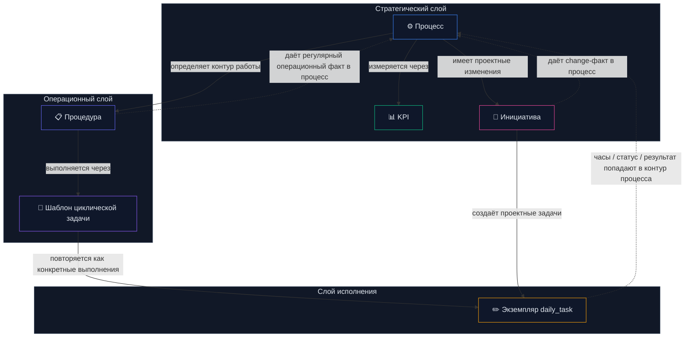
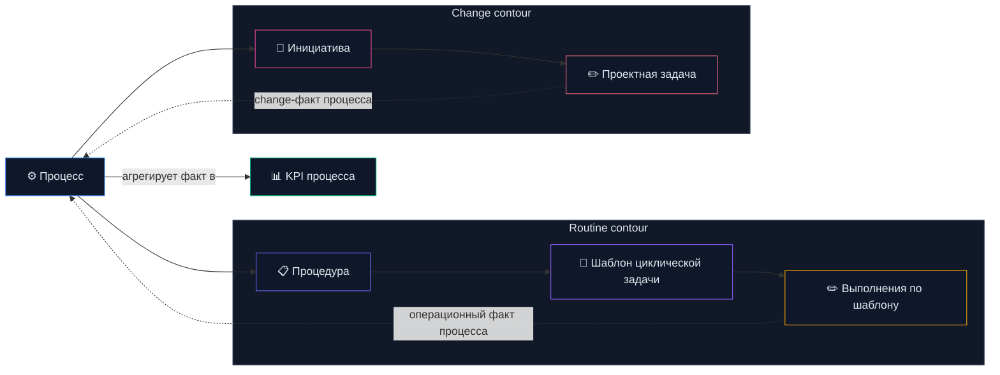
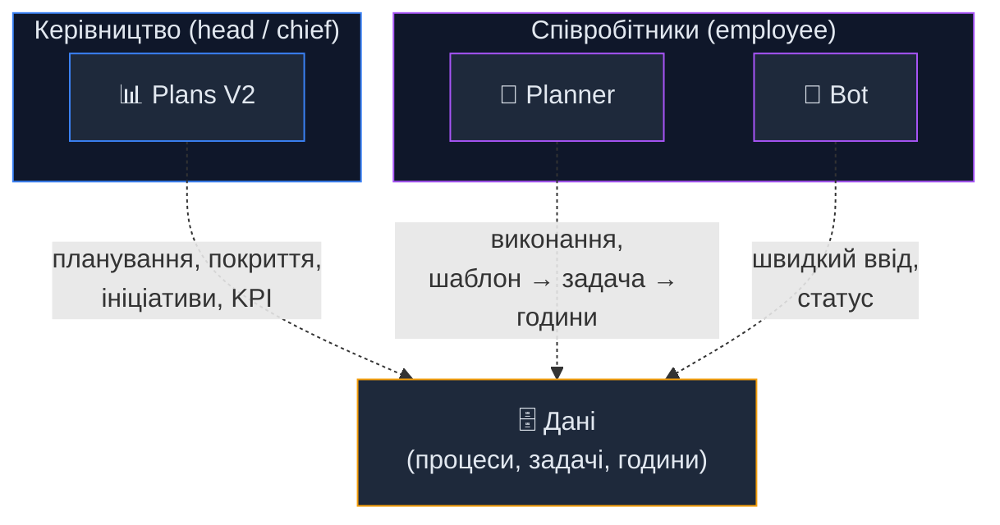
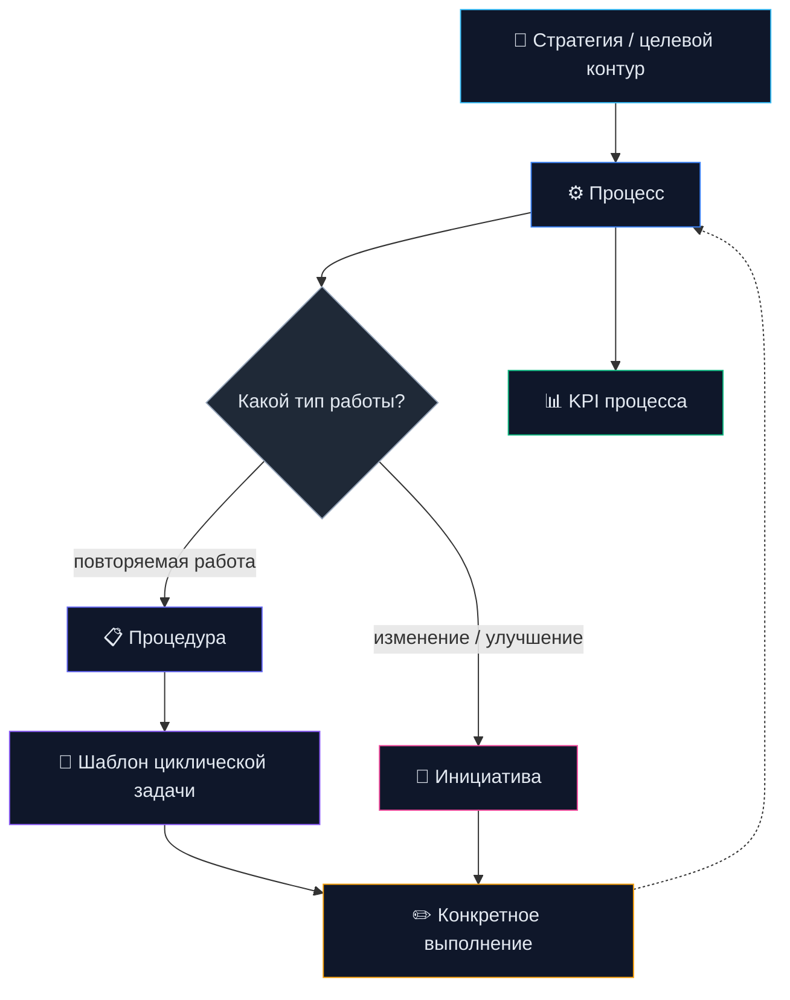
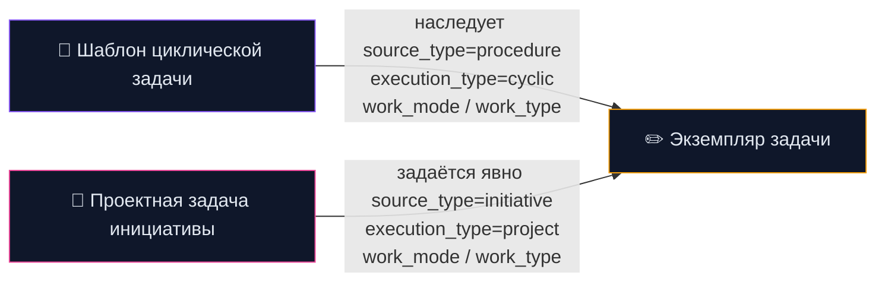
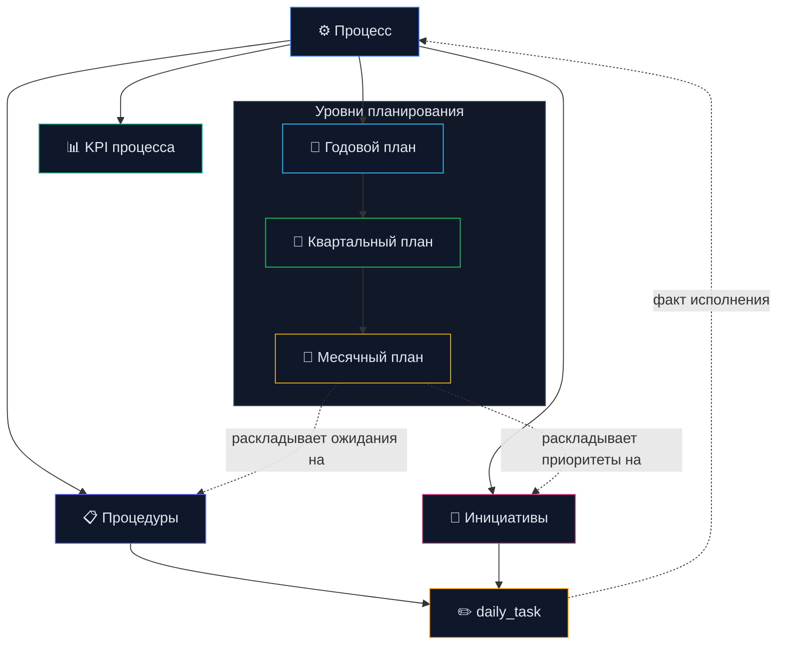

# ===== FILE: BUSINESS_REQUIREMENTS.md =====

# Бизнес-требования CS Platform

> Версия: 3.0
> Последнее обновление: 2026-03-03
> Статус: актуально

## 1. Назначение

CS Platform — внутренняя система планирования, контроля выполнения работ,
отчетности и корпоративной базы знаний подразделения информационной безопасности.

Ключевые цели:

- управление годовыми, квартальными и месячными планами
- фиксация ежедневного выполнения задач
- формирование отчетности (PDF/DOCX/Excel) и мониторинг KPI
- корпоративная база знаний с AI-поиском (RAG)
- бот-платформа (Telegram + Teams) для оперативного доступа
- ролевое управление доступом и согласованием

## 2. Роли

- `chief`: утверждает планы, видит все подразделения, управляет эталонами AI
- `head`: создает и ведет планы своего подразделения, контролирует исполнение, управляет эталонами AI
- `employee`: выполняет назначенные работы и ведет ежедневные задачи

## 3. Доменная модель

Иерархия планирования:

1. годовой план
2. квартальный план
3. месячный план
4. ежедневная задача

Дополнительные сущности:

- департаменты, процессы, услуги
- процедуры/показатели (procedures)
- компании (привязка на уровне задач, не планов)
- проекты (кросс-департаментное тегирование задач)

## 4. Функциональные требования

### FR-01 Жизненный цикл планов

- создание/редактирование/удаление годовых, квартальных и месячных планов
- поддержка допустимых родительских связей
- ролевой контроль переходов статусов
- копирование квартальных планов между периодами

### FR-02 Согласование

- `head` отправляет план на согласование
- `chief` утверждает или возвращает на доработку с комментарием
- переходы статусов аудируются в ленте активности

### FR-03 Исполнение задач

- `employee` создает ежедневные задачи в разрешенном контексте
- задача содержит дату, описание, часы, опционально вложение (SharePoint) и проект
- привязка компаний на уровне задачи (daily_task_companies)
- ограничения по трудозатратам проверяются бизнес-правилами
- автоматическое извлечение номера СЗ из вложений

### FR-04 Ведение справочников

- управление сотрудниками, компаниями, показателями и проектами
- инфраструктура компаний (серверы/рабочие станции по месяцам)
- производственный календарь (рабочие/нерабочие дни)
- стандарт двухпанельного интерфейса для CRUD

### FR-05 Отчетность

- отчеты по компании (PDF с подписями, печатями, ПДВ)
- отчеты по сотруднику (PDF)
- квартальные отчеты/планы (PDF)
- сводная таблица (pivot) по периодам
- Excel-экспорт
- AI-генерация примечаний к отчетам (Claude)
- контроль прав доступа в отчетных API

### FR-06 KPI

- три уровня: процессный (employee/месяц), операционный (head/квартал), стратегический (chief/год)
- формула: KPI = факт_часы / план_часы × 100%
- нормо-часы = 70% ёмкости (рабочие дни × 8ч − отпуск)
- bench (нормо-ёмкость) по отделам и процессам
- пороги: ≥130% amber, ≥100% green, ≥70% orange, <70% red

### FR-07 Бот-платформа

- два канала доставки: Telegram и Teams (Jarvise)
- 8 инструментов через единый реестр (bot-adapter pattern)
- прямые команды (кнопки без AI) и AI-routing (tool-calling)
- scope enforcement в коде (own/department/all)
- персональные API-ключи (шифрование AES-256-GCM)
- push-уведомления при создании планов

### FR-08 База знаний (KB)

- индексация .docx документов (mammoth → chunk → embed → store)
- гибридный поиск: vector (cosine, Voyage multilingual-2 1024d) + BM25 + RRF
- contextual retrieval (контекстный префикс при embedding)
- AI-синтез ответа (Claude Haiku) с цитированием фрагментов
- валидация документов перед индексацией (структурные + AI проверки)
- категоризация документов
- доступ через бот (/doc команда) и веб-интерфейс

### FR-09 AI-функции

- AI-ассистент задач (анализ вложений, помощь с описанием)
- AI-анализ активности (выявление паттернов)
- AI-очистка задач (нормализация описаний)
- AI-эталоны (reference examples для повышения качества описаний)

### FR-10 Еженедельный дайджест

- автоматическая рассылка (пн 09:00) через pm2 cron
- персонализированный контент по роли (chief/head/employee)
- мультиканальная доставка (Telegram + Teams)

### FR-11 Совещания

- интеграция с Microsoft Graph (список совещаний, транскрипции)
- AI-суммаризация транскрипций
- фильтрация по сотрудникам

### FR-13 Планирование отпусков

- сотрудник выбирает месяц и рабочие дни для отпуска, отправляет заявку
- заявка содержит: год, месяц, массив дней, комментарий
- ограничение: одна заявка на месяц (UNIQUE user_id + year + month)
- отклоненную заявку можно перезаписать новой
- head утверждает/отклоняет заявки своего отдела, chief — все заявки
- при утверждении: дни автоматически записываются в `employee_timesheet` кодом 'О'
- запись 'О' происходит только вместо '8' (рабочий день); 'В'/'С'/'Б'/'К' не перезаписываются
- если табель за месяц отсутствует — создается из шаблона `monthly_working_days`
- валидация: нельзя выбрать выходные/праздничные дни (и в UI, и в API)
- chief не создает заявки — редактирует табель напрямую

### FR-12 Активность

- лента активности (UNION activities + daily_tasks)
- фильтрация по отделу, типу действия
- changelog обновлений платформы

## 5. Нефункциональные требования

### NFR-01 Безопасность

- аутентификация через Microsoft 365 (Azure AD)
- custom JWT (HS256) для Supabase, refresh каждые 40 мин
- авторизация по ролям в API routes (isRequestAuthorized + getDbUserId)
- RLS на всех таблицах (TO authenticated)
- rate limiting на всех API endpoints
- SECURITY DEFINER на RPC с бизнес-логикой

### NFR-02 Надежность

- стабильная работа в ежедневной эксплуатации (~21 пользователь)
- предсказуемая обработка ошибок и структурированное логирование (logger)
- graceful fallback в KB поиске (retry с понижением порогов)

### NFR-03 Производительность

- интерфейс дашборда отзывчив при штатной нагрузке
- справочные данные кешируются (staleTime: Infinity)
- агрегации через view (v_monthly_plan_hours, v_activity_feed)
- исключать лишние запросы к БД в горячих сценариях

### NFR-04 Поддерживаемость

- код и документация отражают текущую monthly-модель (без weekly)
- доменные операции централизованы в lib/ops/, lib/kb/
- 4-folder архитектура: lib/ (bot, kb, ops, shared), components/ (auth, navigation, ui, dashboard)

## 6. Исключенная устаревшая область

Weekly-модель удалена и не входит в текущий контур.

## 7. Связанные документы

- `docs/ARCHITECTURE.md` — модули, потоки данных (source of truth)
- `docs/DECISIONS.md` — журнал архитектурных решений
- `docs/DEVELOPER_GUIDE.md` — руководство разработчика
- `docs/TELEGRAM_BOT.md` — бот-платформа
- `docs/KB_RAG.md` — Knowledge Base (RAG pipeline)
- `docs/UI_DESIGN_SYSTEM.md` — дизайн-система
- `docs/database/SCHEMA.md` — схема БД


# ===== FILE: STRATEGY_PLANS_KPI.md =====

# Стратегия развития: Plans V2, Planner, KPI, процессная модель

> Последнее обновление: 2026-04-01
> Консолидация из: SOC_KPI_IDEAS, PLANSV2_PLANNER_TARGET_MODEL, POLICY_PROCESS_MATRIX, PROCESS_TARGET_MAP_AND_ROADMAP
> Данные БД: снапшот 2026-03-31

---

## 1. Архитектурная модель

### Модель в одном абзаце

Процесс — это верхний контейнер ответственности и уровень KPI. Внутри процесса
есть процедуры и инициативы. Процедура — это устойчивый operational block с
понятным набором сотрудников, регулярной нагрузкой и ограниченным набором
типовых шаблонов задач. Инициатива — это change-work внутри того же процесса,
обычно с квартальной оценкой трудоёмкости, но без жёсткого регулярного ритма.
Шаблон задаёт канонический вид повторяемой работы. `daily_task` фиксирует
конкретный факт выполнения. KPI агрегируют факт только на уровне процесса.

### Архитектурные правила модели

1. Процесс — единственный верхний уровень KPI.
2. Процедуры и инициативы не конкурируют, а являются двумя источниками работы внутри процесса.
3. Процедура — не просто папка шаблонов, а единица исполнения.
4. Шаблоны нужны для повторяемой работы внутри процедуры.
5. `daily_task` — единственная единица фактического исполнения.
6. Capacity процедуры считается из ресурса сотрудников, а не делится поровну "по участию".
7. Инициативы планируются через квартальную оценку change-load, а не через жёсткий регулярный норматив.
8. Распределение по компаниям живёт на уровне задач и не должно раздувать число процедур.
9. Планы задают ожидания и горизонт, но не являются источником работы.
10. KPI процесса и company allocation задачи — разные аналитические оси.

### Схема 1. Каркас сущностей и связей



Архитектурные принципы:
- Процесс — главный контейнер смысла и ответственности
- Процедура — operational unit внутри процесса: у неё есть свой кусок работы, свои исполнители и плановый объём времени
- Шаблон задачи — это не просто заготовка, а типовая циклическая единица работы процедуры
- `daily_task` — конкретный экземпляр выполнения шаблона или проектной задачи
- Инициатива — change path внутри того же процесса, обычно с квартальной оценкой нагрузки, но без жёсткого регулярного ритма
- KPI считаются только на уровне процесса и агрегируют весь факт внутри него

### Схема 2. Два контура работы: routine vs change



Смысл схемы:
- процедуры и шаблоны нужны для повторяемой работы;
- процедура задаёт не только группу шаблонов, но и рамки исполнения для группы сотрудников;
- шаблон = канонический тип циклической задачи внутри процедуры;
- инициативы нужны для изменений;
- у процедур время и исполнители определены через employee allocation, у инициатив время задаётся как quarterly change estimate;
- оба контура расходуют capacity одного и того же процесса;
- KPI агрегируют общий факт процесса и показывают баланс между routine и change.

### Схема 3. Інструменти (хто через що працює)



`Plans V2`, `Planner`, `Bot` — это инструменты и точки входа, а не часть доменной модели.
Политики СУІБ связаны с процессами через маппинг покрытия, но не входят в операционный pipeline выполнения.

### Схема 4. Как читать модель сверху вниз



---

## 2. Целевое разделение модулей

| Модуль | Роль | Аудитория |
|--------|------|-----------|
| **Plans V2** | Управленческий слой: покрытие, нагрузка, резерв, planned/unplanned, инициативы | Heads / Chiefs |
| **Planner** | Исполнительский слой: слот → шаблон → часы → компания | Employees |
| **Task Templates** | Канонические циклические задачи внутри процедур | Системный |
| **Initiatives** | Change-слой внутри процесса: цель, deliverable, статус, quarterly change estimate | Heads / Chiefs |
| **KPI** | Агрегатор факта на уровне процесса: plan + actual + capacity + unplanned | Автоматический |

Принцип исполнения: **минимум ручного ввода**, `template-first`, комментарий только для инцидентов и отклонений.

---

## 3. Текущее состояние процессной модели (снапшот 2026-03-31)

### Агрегированное покрытие

| Процесс | Процедур | Шаблонов | Задач | Часы |
|---|---:|---:|---:|---:|
| Моніторинг та реагування на події та інциденти ІБ | 2 | 10 | 794 | 2274.7 |
| Управління правами доступу | 2 | 5 | 178 | 1181.0 |
| Взаємодія з контрагентами | 3 | 13 | 161 | 839.0 |
| Управління ризиками ІБ | 4 | 4 | 110 | 591.0 |
| Управління документацією СУІБ | 4 | 4 | 163 | 538.0 |
| Управління захистом даних в ІС | 4 | 16 | 73 | 432.0 |
| Управління безпекою ІС | 5 | 8 | 169 | 832.0 |
| Управління безпекою обчислювальних систем | 2 | 3 | 70 | 378.5 |
| Навчання та підвищення обізнаності | 2 | 7 | 49 | 246.0 |
| Облік та звітність | 3 | 10 | 47 | 173.5 |
| **Управління безпекою мережі** | **2** | **0** | **0** | **0.0** |

Использование шаблонов: **~136 из шаблона vs ~1464 manual** — шаблонная модель пока не основной контур.

### Целевая process map по уровням

| Уровень | Процессы |
|---------|----------|
| **A. Core operations** | Моніторинг/реагування, Управління доступом, Управління ризиками |
| **B. Engineering & control** | Безпека ІС, Безпека мережі, Безпека обчислювальних систем, Захист даних |
| **C. Governance** | Документація СУІБ, Навчання, Взаємодія з контрагентами, Облік/звітність |
| **D. Candidates** | Криптозахист, Безперервність, Мобільні пристрої, Захист від malware, Фізична безпека |

---

## 4. Главные разрывы

1. **KB и процессы не связаны** — документы есть, процессы есть, но `kb_documents.process_id` не используется как рабочая привязка
2. **Не все политики СУІБ покрыты процессами** — crypto, malware, mobile, physical security, continuity не имеют соответствующих процессов в маппинге покрытия
3. **Пустые процессы** — "Управління безпекою мережі": 0 шаблонов, 0 задач
4. **Шаблоны не стали основным путём** — ~8% задач из шаблонов
5. **Пустые title в задачах** — мешает аналитике и будущему KPI

---

## 5. Семантические шаблоны задач (целевая модель)

### Типизация задач как отдельное измерение модели

Тип задачи в этой архитектуре не равен просто названию задачи. Это отдельный слой
смысла, который нужен для правильной маршрутизации работы, аналитики и KPI.

Одна и та же задача должна отвечать минимум на четыре вопроса:
- из какого контура она пришла: процедура или инициатива;
- это циклическая работа или проектная;
- работа плановая или реактивная;
- какой у неё операционный смысл для аналитики процесса.

### Базовые оси типизации

| Ось | Поле | Значения | Зачем нужно |
|---|---|---|---|
| Источник работы | `source_type` | `procedure`, `initiative` | Понять, это routine contour или change contour |
| Характер исполнения | `execution_type` | `cyclic`, `project` | Отличить повторяемое выполнение от разовой проектной работы |
| Режим работы | `work_mode` | `planned`, `unplanned` | Делить baseline и reactive load |
| Операционный смысл | `work_type` | `monitoring`, `event_analysis`, `incident_response`, `request_processing`, `reporting`, `audit`, `tuning`, `improvement`, `internal_admin` | Нормальный срез KPI и нагрузки |

### Логика наследования



### Архитектурный смысл

- Шаблон задаёт типовую циклическую работу процедуры
- Конкретная задача наследует типизацию от шаблона, если она создана из процедуры
- Проектная задача инициативы может создаваться без шаблона, но всё равно обязана иметь типизацию
- KPI не считаются на уровне типа задачи напрямую, но используют типизацию как разрез аналитики внутри процесса

### Процедура как единица исполнения

В этой модели процедура нужна не только для группировки шаблонов.

Процедура одновременно задаёт:
- понятный кусок большого процесса;
- ограниченный набор типовых шаблонов;
- круг сотрудников, которые работают в этом контуре;
- ожидаемый объём регулярного времени.

Практически это означает:
- большой процесс можно разложить на 3–5 процедур;
- в каждой процедуре держать 3–5 шаблонов;
- сотрудники работают не с "всем процессом сразу", а в рамках своей процедуры;
- факт по задачам затем агрегируется обратно на уровень процесса.

### Ресурс сотрудников и capacity процедуры

Если сотрудник участвует в нескольких процедурах, его время нельзя делить
поровну автоматически. Участие в процедуре и доля ресурса в процедуре — это
разные сущности.

Поэтому архитектурно нужно разделять:
- `assignment` — сотрудник участвует в процедуре;
- `allocation` — какая доля ресурса сотрудника уходит в процедуру.

Следствие:
- capacity процедуры не задаётся "вручную из воздуха";
- capacity процедуры вычисляется из аллокаций сотрудников;
- один сотрудник может участвовать в нескольких процедурах одного или разных процессов;
- доли участия могут быть разными и не обязаны делиться пропорционально.

Принцип расчёта:

```text
employee quarterly capacity × allocation share
    → contribution to procedure capacity

sum(contributions of all employees)
    → procedure capacity

sum(capacity of procedures in process)
    → process capacity
```

Это нужно для KPI, потому что KPI процесса должны опираться на реальный ресурс
людей, а не на условное "ожидаемое время процедуры".

Практическая трактовка:
- участие сотрудника в процедуре ещё не означает равную долю времени;
- доля времени должна задаваться явно;
- одна и та же процедура может собирать capacity из нескольких людей;
- один и тот же сотрудник может давать разный вклад в разные процедуры и процессы.

### Отдельное измерение: распределение задач по компаниям

Для помесячного учёта по предприятиям задача может делиться по компаниям с
весами. Это распределение не должно зашиваться в процедуры, иначе модель
процедур начнёт разрастаться только ради аналитики компаний.

Архитектурно это отдельное измерение, независимое от KPI процесса:
- процесс отвечает за KPI;
- процедура отвечает за operational unit и шаблоны;
- задача отвечает за факт выполнения;
- распределение по компаниям отвечает только за управленческий и отчётный учёт по предприятиям.

Правильная логика:
- одна и та же процедура может обслуживать несколько компаний;
- одна и та же задача может относиться к нескольким компаниям;
- связь с компаниями должна жить на уровне задачи, а не на уровне процедуры;
- распределение должно быть весовым, а не бинарным.

Пример:

```text
daily_task
  ├── company A = 60%
  └── company B = 40%
```

Что это даёт:
- не нужно плодить процедуры под каждую компанию;
- можно корректно строить месячный учёт по предприятиям;
- одна задача остаётся одной задачей в процессе;
- company split не ломает KPI процесса, а существует как параллельный аналитический слой.

Архитектурный принцип:
- `process KPI` и `company allocation` — разные оси модели;
- KPI агрегируются по процессу;
- company allocation агрегируется по задачам;
- пересекать их можно в аналитике, но не смешивать в самой структуре сущностей.

### Практический вывод

Минимальный набор для будущей модели:
- у шаблона есть `work_mode`, `work_type`, `default_expected_hours`, `default_effort_weight`
- у конкретной задачи есть `source_type`, `execution_type`, `work_mode`, `work_type`, `expected_hours`, `effort_weight`
- у инициативных задач `source_type=initiative`, `execution_type=project`
- у процедурных циклических задач `source_type=procedure`, `execution_type=cyclic`

### Новые поля для `procedure_task_templates`

| Поле | Значения | Назначение |
|------|----------|------------|
| `work_mode` | `planned` / `unplanned` | Плановая vs реактивная работа |
| `work_type` | `monitoring`, `event_analysis`, `incident_response`, `request_processing`, `reporting`, `audit`, `tuning`, `improvement`, `internal_admin` | Операционный смысл |
| `default_expected_hours` | число | Ожидаемая трудоёмкость |
| `default_effort_weight` | число | Вес для взвешенной аналитики |
| `requires_comment` | bool | Комментарий обязателен (инциденты, отклонения) |

### Новые поля для `daily_tasks` (наследуются от шаблона)

- `work_mode`, `work_type`, `effort_weight`, `expected_hours`
- `is_exception`, `deviation_reason`

### Пример

Процедура: Моніторинг подій ІБ

| Шаблон | work_mode | work_type |
|--------|-----------|-----------|
| Моніторинг подій | planned | monitoring |
| Аналіз підозрілої події | unplanned | event_analysis |
| Реагування на інцидент | unplanned | incident_response |

---

## 5b. Инициативы (проектная работа внутри процесса)

Инициатива — разовая проектная/улучшенческая работа, привязанная к процессу, но НЕ являющаяся процедурой.

**Примеры:** внедрение нового SIEM, разработка политики криптозащиты, миграция системы контроля доступа.

### Каскадирование по уровням планов

Инициативы следуют той же иерархии что и планы:

```text
Годовий план процесу
  └── Ініціатива: "Впровадження SIEM" (рік, ціль + бюджет)
        └── Квартальний план
              └── Ініціатива: "Етап 1 — вибір рішення" (Q1, deliverable)
                    └── Місячний план
                          └── Задачі: конкретна робота (daily_tasks)
```

- **Годовая** — стратегическая цель, бюджет, ожидаемый результат
- **Квартальная** — этап с конкретным deliverable и оценочным change-load
- **Месячная** — разбивка на задачи сотрудникам

Инициатива может существовать на любом уровне — не обязательно каскадировать сверху вниз. Квартальная инициатива может быть без годовой.

### Текущее состояние БД
- `quarterly_plan_initiatives` (id, quarterly_plan_id, title, description, status) — уже существует
- `daily_tasks.project_id` — привязка задач к проекту уже есть
- **Нет:** годовых и месячных инициатив (нужны `annual_plan_initiatives`, `monthly_plan_initiatives` или единая таблица с уровнем)

### Отличие от процедур

| | Процедура | Инициатива |
|---|---|---|
| Характер | Рутинная, повторяющаяся | Разовая, проектная |
| Роль в процессе | Operational unit | Change unit |
| Исполнители | Обычно заранее понятны и закреплены | Могут меняться по этапам |
| Время | Есть capacity из employee allocations | Есть квартальная оценка change-load, но нет жёсткого регулярного ритма |
| Уровни | Постоянная, привязана к процессу | Годовая → квартальная → месячная |
| Шаблоны | Да (template-first) | Нет (свободные задачи) |
| KPI | Даёт регулярный операционный факт в процесс | Даёт change-факт в процесс |
| Горизонт | Постоянный | Год / квартал / месяц / дедлайн |
| Ввод сотрудника | Шаблон → часы | Задача → часы → результат |

### Связь с KPI
- KPI — процессный. Инициатива привязана к процессу → её факт идёт в тот же котёл процесса
- Capacity процесса в основном идёт снизу от процедур через employee allocations
- Для инициатив нужен отдельный quarterly estimate, чтобы change-load не был "невидимым" в плане
- **Ничего не меняется в верхнем уровне KPI** — инициатива остаётся ещё одним источником факта внутри процесса
- Полезная аналитика сверху: баланс routine/change по процессу и доля change-load в квартале

---

## 6. Где в модели находятся планы

План в этой архитектуре не является источником работы сам по себе. План — это слой
управления и распределения ожиданий поверх процесса.

Иначе:
- процесс = что мы вообще делаем;
- процедура / инициатива = откуда берётся работа;
- задача = что реально выполняется;
- план = сколько, когда и в каком горизонте мы ожидаем выполнить.

### Схема 5. Планы как управленческий слой над процессом



### Основной принцип

- План не подменяет процесс
- План не подменяет инициативу
- План не подменяет задачу
- План задаёт горизонт, объём, приоритет и ожидание
- KPI сравнивают план процесса с фактом процесса
- Для процедур плановое время задаётся через employee allocations
- Для инициатив плановое время задаётся как quarterly change estimate

### Как это читать

| Сущность | Роль |
|---|---|
| `annual plan` | Годовой целевой контур процесса: capacity, направления, резерв |
| `quarterly plan` | Плановый operational/change baseline на квартал |
| `monthly plan` | Ближайшая управленческая раскладка нагрузки |
| `procedure` | Повторяемый источник работы |
| `initiative` | Источник проектной работы |
| `daily_task` | Фактическое исполнение |
| `KPI` | Сравнение plan vs actual на уровне процесса |

### Что важно не смешивать

- План — это не работа, а ожидание работы
- Инициатива — это не план, а источник change-работы
- Процедура — это не план, а источник регулярной работы
- Задача — это не план, а факт исполнения

### Практический вывод

Плановая модель должна отвечать на три разных вопроса:
- что должно происходить регулярно в процессе;
- какие изменения должны происходить в процессе;
- сколько capacity и какого факта ожидается в этом горизонте.

---

## 7. Целевые метрики KPI

Не только `fact / plan`, а:

| Метрика | Формула |
|---------|---------|
| Capacity Coverage | Capacity / Required Load |
| Plan Coverage | Actual Planned Work / Planned Baseline |
| Reserve Consumption | Unplanned Work / Reserve |
| Utilization | Actual Total Work / Capacity |
| Overload Gap | Required Load − Capacity |

Разрезы: по процессу, процедуре, компании, сотруднику.

Дополнительно: planned/unplanned split, incident share, company-driven reactive load, template mix.

---

## 8. Roadmap

### Phase 1. Нормализация process map
- Закрепить canonical list процессов от политик СУІБ
- Связать `kb_documents → processes`
- Определить ownership по каждому процессу

### Phase 2. Очистка существующих процессов
Приоритет: Моніторинг → Безпека ІС → Доступ → Ризики
- Пересмотреть описания процедур
- Развести governance vs execution
- Выделить недостающие operational procedures

### Phase 3. Заполнить пустые operational gaps
- Управління безпекою мережі (0 шаблонов, 0 задач)
- Backup/recovery, continuity
- Policy areas без явного процесса (crypto, malware, mobile, physical)

### Phase 4. Семантические шаблоны
- Расширить `procedure_task_templates` новыми полями
- Расширить `daily_tasks` наследуемыми полями
- Классифицировать существующие шаблоны
- Перевести planner flow на template-first

### Phase 5. Очистка фактических задач
- Разобраться с пустыми `daily_tasks.title`
- Ввести обязательные значения от шаблона
- Минимизировать ручной free-text ввод

### Phase 6. Новый KPI
- Capacity / baseline / reserve модель на квартальном уровне
- Planned/unplanned split на месячном/процедурном уровне
- Process/company/employee overload analytics

---

## 9. Маппинг покрытия: процессы ↔ политики (сводка)

> Процессы и политики — независимые сущности. Маппинг показывает, какие процессы
> обеспечивают соблюдение каких политик. Это аналитика покрытия, а не иерархия.

### Полное покрытие
- Моніторинг та реагування ↔ Вимоги щодо моніторингу
- Управління доступом ↔ Вимоги щодо управління правами доступу
- Управління ризиками ↔ Методологія управління ризиками + Вимоги щодо ідентифікації ризиків
- Документація СУІБ ↔ Вимоги щодо управління документацією
- Навчання ↔ Вимоги щодо навчання та обізнаності
- Безпека ІС ↔ Вимоги щодо налаштування безпеки ІС + вразливості ІС
- Безпека обчислювальних систем ↔ Вимоги щодо налаштування + вразливості

### Частичное покрытие
- Безпека мережі ↔ Вимоги є, але процес порожній
- Резервне копіювання ↔ процедура є, факту немає
- Життєвий цикл ІС ↔ перетинає кілька процесів
- Безперервність ↔ вбудовано в risk management

### Разрывы (политика есть, процесса нет)
- Криптографічний захист інформації
- Захист від зловмисного коду
- Безпека мобільних пристроїв
- Фізична безпека серверних приміщень

---

## 10. Open Questions / Decisions To Lock

Ниже список решений, которые лучше зафиксировать отдельно до перехода к финальной
модели таблиц, API и UI.

### 1. Где хранить employee allocation на процедуры

Нужно определить:
- отдельная таблица allocations;
- связь allocation с кварталом;
- хранится ли allocation в процентах, весах или часах;
- допускается ли смешанная модель (проценты + override в часах).

Рекомендуемое направление:
- хранить allocation как квартальную долю ресурса сотрудника на процедуру;
- capacity процедуры считать производно.

### 2. Как фиксировать quarterly change estimate для инициатив

Нужно определить:
- estimate хранится на инициативе или на quarterly-plan-initiative;
- estimate задаётся в часах, story points или effort weight;
- можно ли дробить estimate по месяцам.

Рекомендуемое направление:
- quarterly change estimate хранить на квартальной инициативе в часах;
- monthly split считать вторичным и необязательным.

### 3. Нужно ли хранить связь `daily_task -> template_id`

Сейчас модель проекта ближе к подходу, где шаблон только подставляет данные, а
задача становится самостоятельной.

Нужно окончательно решить:
- оставляем задачу без FK на шаблон;
- или добавляем слабую связь для аналитики происхождения.

Рекомендуемое направление:
- не делать жёсткий FK обязательным;
- при необходимости хранить nullable reference только для traceability.

### 4. Где хранить company allocation задачи

Нужно определить:
- отдельная таблица many-to-many с весом на компанию;
- хранится ли вес в процентах или в нормализованной доле;
- допустимы ли задачи без company split.

Рекомендуемое направление:
- task-company allocation хранить в отдельной таблице;
- вес считать независимым от KPI-потока процесса.

### 5. На каком уровне показывать KPI в UI

Сейчас архитектурно KPI процессные.

Нужно определить:
- показываем ли KPI только по процессам;
- разрешаем ли drill-down по процедурам как аналитический view;
- как показывать routine/change split.

Рекомендуемое направление:
- KPI считать только по процессам;
- процедуры использовать как drill-down и explain layer.

### 6. Нужно ли закреплять сотрудников за процедурами жёстко

Нужно определить:
- assignment обязателен всегда;
- можно ли создавать задачу в процедуре без формального assignment;
- как обрабатывать временное подключение сотрудника к процедуре.

Рекомендуемое направление:
- assignment обязателен для плановой модели;
- временные отклонения разрешать как exception path.

### 7. Какой минимальный обязательный набор полей у задачи

Нужно определить минимальный контракт `daily_task`, чтобы дальше не плодить
неполные сущности.

Рекомендуемое направление:
- `source_type`
- `execution_type`
- `work_mode`
- `work_type`
- `spent_hours`
- `task_date`
- `process_id` или выводимый process context
- optional `company allocation`

### 8. Как формально развести procedure capacity и initiative load

Нужно определить:
- входят ли инициативы в общий capacity ceiling процесса;
- показывается ли initiative load как reserve consumption;
- считаются ли инициативы отдельно от baseline procedure capacity.

Рекомендуемое направление:
- procedure capacity считать как baseline resource model;
- initiative load считать как separate quarterly change load;
- сводить их вместе только на уровне process KPI.


# ===== FILE: USER_GUIDE.md =====

# Руководство пользователя — CS Platform

## Содержание

1. [Вход в систему](#1-вход-в-систему)
2. [Роли и доступ](#2-роли-и-доступ)
3. [Активность](#3-активность)
4. [Планы и задачи](#4-планы-и-задачи)
5. [Отчёты](#5-отчёты)
6. [Сводная таблица](#6-сводная-таблица)
7. [KPI](#7-kpi)
8. [Справочники](#8-справочники)
9. [Telegram-бот](#9-telegram-бот)
10. [Вопросы и ответы](#10-вопросы-и-ответы)

---

## 1. Вход в систему

Откройте приложение в браузере и нажмите **«Войти»**. Авторизация выполняется через корпоративную учётную запись — отдельный пароль не требуется. После успешного входа система автоматически определит вашу роль и откроет доступные разделы.

---

## 2. Роли и доступ

В системе три роли с разным уровнем доступа:

| Роль | Видит данные | Доступные разделы |
|------|-------------|-------------------|
| **Сотрудник** | Только свои | Активность, Планы |
| **Начальник отдела** | Свой отдел | Активность, Планы, Отчёты, Сводная, KPI, Справочники |
| **Руководитель** | Вся организация | Все разделы |

Если нужный раздел недоступен — обратитесь к руководителю для уточнения роли.

---

## 3. Активность

Раздел отображает сводку рабочей активности за выбранный период (7 или 30 дней).

**Что показывает:**
- Общее количество часов и выполненных задач
- Количество активных сотрудников
- Среднее число часов на человека
- Ленту событий: кто и что делал, когда были созданы и завершены задачи

**Начальники и руководители** дополнительно получают доступ к **AI-анализу** — автоматическому разбору активности с выявлением лидеров, предупреждений и общих тенденций.

---

## 4. Планы и задачи

### Структура планирования

Планы в системе организованы иерархически:

```
Годовой план
  └── Квартальный план
        └── Месячный план
              └── Ежедневные задачи
```

Каждый месячный план привязан к конкретной процедуре и содержит плановые часы, фактически отработанные часы и процент выполнения.

### Статусы плана

| Статус | Описание |
|--------|----------|
| Черновик | Создан, но не подан |
| Подан | Отправлен на согласование |
| Утверждён | Одобрен руководством |
| Активен | Текущий рабочий период |
| Выполнен / Провален / Возвращён | Завершённые состояния |

### Создание задачи

Сотрудники добавляют задачи в активный месячный план. При создании задачи заполняются:

- **Описание** — что было сделано. Система автоматически улучшает текст: выравнивает стиль и переводит на украинский язык
- **Часы** — фактически затраченное время
- **Дата** — день выполнения
- **Предприятия** — к каким компаниям относится работа
- **Тип распределения часов** — как разбить время между предприятиями: поровну, пропорционально серверам или рабочим станциям
- **Проект** — если задача относится к конкретному проекту
- **Файл** — вложение при необходимости

> **Подсказки:** При вводе описания система предлагает готовые шаблоны из справочника эталонных описаний — их можно выбрать одним кликом.

### Права на создание и редактирование планов

- **Сотрудник** — добавляет задачи в назначенные ему активные планы
- **Начальник отдела** — создаёт и редактирует планы своего отдела
- **Руководитель** — полный доступ ко всем планам

---

## 5. Отчёты

Раздел содержит четыре типа отчётов.

### Предприятия

Детализированный отчёт по выбранному предприятию за конкретный месяц. Показывает перечень выполненных процедур с часами и задачами. Для каждой процедуры можно сгенерировать **AI-нотатку** — краткое резюме выполненных работ.

**Экспорт:**
- **PDF** — официальный документ с таблицей, подписями и НДС
- **DOCX** — редактируемый документ Word

### Сотрудники

Отчёт по конкретному сотруднику за выбранный месяц: задачи, часы, предприятия, процессы.

### Месяцы

Сводная таблица за выбранный месяц с группировкой по:
- Предприятиям
- Отделам (с численностью и загруженностью)
- Сотрудникам
- Процедурам
- Процессам

**Экспорт:** XLSX (Excel)

### Кварталы

Квартальные документы с тремя видами представления: план, отчёт, разбивка по отделам. Для процедур доступна генерация AI-нотаток.

**Экспорт:**
- Квартальный план — **PDF**
- Квартальный отчёт — **DOCX**

---

## 6. Сводная таблица

Интерактивный инструмент для анализа данных в произвольных разрезах.

**Параметры настройки:**

| Параметр | Варианты |
|----------|----------|
| Период | Месяц / Квартал / Год |
| Группировка | Предприятие / Отдел / Сотрудник / Процесс / Процедура / Категория |
| Метрика | Часы / Задачи / План / Стоимость / KPI% |
| Детализация | По месяцам / Кварталам / Годам |

Таблица дополняется диаграммами. Результат можно выгрузить в **XLSX**.

---

## 7. KPI

Показатель эффективности рассчитывается по формуле:

**KPI = фактические часы / плановые часы × 100%**

### Цветовые индикаторы

| Цвет | Значение | Интерпретация |
|------|----------|---------------|
| 🔴 Красный | < 70% | Недовыполнение |
| 🟠 Оранжевый | 70–99% | Нормальная загрузка |
| 🟢 Зелёный | 100–129% | Перевыполнение |
| 🟡 Жёлтый | ≥ 130% | Критическая перегрузка |

### KPI по ролям

| Роль | Период | Содержание |
|------|--------|------------|
| Сотрудник | Месяц | KPI по своим процессам и процедурам |
| Начальник отдела | Квартал | KPI отдела: процессы, сотрудники, тренд |
| Руководитель | Год | KPI по отделам, процессам, квартальный тренд |

---

## 8. Справочники

Раздел доступен начальникам отделов и руководителям. Содержит шесть вкладок.

### Проекты
Список проектов организации. Руководитель может активировать или деактивировать проект.

### Процедуры
Справочник рабочих процедур, сгруппированных по процессам и категориям (стратегические / процессные / операционные).

### Предприятия
Карточки обслуживаемых компаний: полное название, директор, договор, тариф, история изменений инфраструктуры (серверы, рабочие станции).

### Сотрудники
Управление профилями сотрудников: ФИО, отдел, должность, роль, ставка (0.25 / 0.5 / 0.75 / 1.0), статус. Здесь же выполняется подключение Telegram-бота (см. раздел 9).

### Календарь (Табель)
Производственный календарь с поячеечным редактированием. Коды дней:

| Код | Тип дня |
|-----|---------|
| `8` | Рабочий (8 часов) |
| `В` | Выходной |
| `С` | Сокращённый |
| `О` | Отпуск |
| `Б` | Больничный |
| `К` | Командировка |
| `Д` | Отгул |
| `І` | Другое |

### Эталоны AI
Библиотека образцовых описаний задач, сгруппированных по процессам и процедурам. Используется как источник подсказок при создании задач. Руководители и начальники могут добавлять, редактировать и удалять эталоны.

---

## 9. Telegram-бот

Бот позволяет получать данные из системы прямо в Telegram — без открытия браузера. Также бот автоматически присылает уведомления о важных событиях, если вы подписаны.

### Подключение

1. Откройте **Справочники → Сотрудники → свой профиль**
2. Найдите раздел **«Telegram Bot»** и нажмите **«Отримати код»**
3. Отправьте полученный код боту в Telegram
4. Аккаунт привязан — бот готов к работе

**Опционально:** в том же разделе можно добавить персональный API-ключ (OpenAI или Anthropic) для работы с запросами в свободной форме.

### Клавиатура быстрых команд

После привязки бот показывает кнопки — они работают **без API-ключа**:

| Кнопка | Что делает |
|--------|-----------|
| 📄 Мій звіт | Ваш отчёт за текущий месяц |
| 📈 KPI | Ваш KPI за текущий период |
| ⏰ Години | Отработанные часы за месяц |
| 📋 Плани | Сводка ваших месячных планов |
| 👥 Онлайн | Кто сейчас работает в системе |
| 📑 Звіт по компанії 🤖 | Отчёт по предприятию (нужен API-ключ; head/chief) |
| 📑 Квартальний 🤖 | Квартальный документ (нужен API-ключ; head/chief) |

### Свободные запросы (AI)

Если добавлен API-ключ — можно писать вопросы в свободной форме:

| Функция | Что возвращает |
|---------|---------------|
| **KPI** | Показатель эффективности за месяц, квартал или год |
| **Онлайн** | Кто сейчас работает в системе |
| **Активность** | Статистика часов и задач за период |
| **Сотрудники** | Список сотрудников с ролями и отделами |
| **Часы** | Разбивка отработанных часов по сотрудникам и процессам |
| **Планы** | Сводка месячных планов со статусами |
| **Отчёт (текст)** | Текстовый отчёт по сотруднику |
| **Отчёт DOCX** | Готовый документ по предприятию за месяц |
| **Квартальный документ** | Квартальный план (PDF) или отчёт (DOCX) |

**Пример запроса:** _«Покажи мой KPI за этот квартал»_, _«Кто сейчас онлайн?»_, _«Сформируй отчёт по ООО Ромашка за январь»_

> Доступные функции зависят от вашей роли и настроек, заданных руководителем. Ограничение: не более 10 сообщений в минуту.

### Уведомления

Если аккаунт привязан — бот автоматически присылает уведомления:

| Событие | Когда приходит |
|---------|---------------|
| **Новый месячный план** | Когда начальник создаёт план и назначает вас исполнителем |

**Пример уведомления:**
```
📋 Вас назначили исполнителем нового плана

📌 Процедура: Обслуживание серверов
📅 Месяц: Февраль 2026
⏱ Плановых часов: 40 ч.
```

Уведомления приходят автоматически — дополнительных действий не требуется. Чтобы их отключить, отвяжите Telegram-аккаунт в настройках профиля.

---

## 10. Вопросы и ответы

**Не вижу нужный раздел в меню**
Доступ зависит от роли. Обратитесь к руководителю — он скорректирует права.

**Не могу добавить задачу в план**
Задачи можно добавлять только в планы со статусом **«Активен»**, назначенные на вас. Если план ещё не активирован — обратитесь к начальнику отдела.

**AI-нотатка не генерируется**
Для генерации AI-нотаток необходимо наличие корпоративного или персонального API-ключа. Уточните у администратора.

**Telegram-бот не отвечает**
Убедитесь, что аккаунт привязан (см. раздел 9). Если проблема сохраняется — попробуйте заново получить и отправить код привязки.

**Нужно восстановить случайно удалённые данные**
Обратитесь к администратору системы — восстановление выполняется из резервной копии базы данных.

**Как узнать, кто администратор системы?**
Список контактов администраторов уточните у своего руководителя.


# ===== FILE: ACTIVE_PROCEDURES_MATRIX.md =====

# Матрица активных процедур и рекомендуемых шаблонов задач

> Последнее обновление: 2026-03-31
> Источник: живая PostgreSQL БД через SSH
> Основа: только `33` активные процедуры (`procedures.is_active = true`)

## Как читать матрицу

- `Тип`:
  - `core` — основная производственная процедура
  - `control` — контроль, аудит, проверка
  - `governance` — методология, согласование, сопровождение
  - `reactive` — реактивная работа, инциденты, внеплановая нагрузка
  - `support` — отчетность, учет, административная поддержка
- `Покрытие`:
  - `сильное` — есть факт и разумное шаблонное покрытие
  - `среднее` — есть факт, но шаблонов мало или описание расплывчато
  - `слабое` — факт почти отсутствует или шаблонов нет
- `Рекомендуемые шаблоны` — не финальный справочник, а рекомендуемый минимальный набор для template-first execution.

---

## 1. Взаємодія з контрагентами

| Процедура | Тип | Шаблонов сейчас | Задач | Часы | Покрытие | Рекомендуемые шаблоны задач |
|---|---|---:|---:|---:|---|---|
| Процедура взаємодії з бізнес-підрозділами та зовнішніми організаціями щодо дотримання вимог ІБ | governance | 5 | 85 | 452.0 | сильное | Експертиза архітектурних рішень; Супровід бізнес-проєкту; Супровід зміни у продуктиві; Консультація підрозділу; Актуалізація реєстру ІС |
| Процедура договірного забезпечення взаємовідносин з контрагентами | governance | 5 | 43 | 140.0 | сильное | Експертиза договору; Перевірка контрагента; Участь у тендері; Погодження ІБ-вимог до договору; Контроль виконання договірних зобов’язань |
| Процедура методичного супровіду взаємодії з бізнес-підрозділами щодо дотримання вимог ІБ | governance | 3 | 33 | 247.0 | среднее | Методична консультація; Аудит змін в ІС; Підготовка рекомендацій; Контроль виконання вимог ІБ |

---

## 2. Моніторинг та реагування на події та інциденти ІБ

| Процедура | Тип | Шаблонов сейчас | Задач | Часы | Покрытие | Рекомендуемые шаблоны задач |
|---|---|---:|---:|---:|---|---|
| Процедура моніторингу подій інформаційної безпеки | core | 5 | 697 | 1741.2 | сильное, но manual-heavy | Моніторинг черги подій; Первинний аналіз спрацювання; Верифікація false positive; Ескалація підозрілої події; Тюнінг правила SIEM; Перевірка джерела логів; Щоденний огляд стану моніторингу; Щотижневий звіт моніторингу |
| Процедура управління інцидентами інформаційної безпеки | reactive | 5 | 97 | 533.5 | сильное | Реєстрація інциденту; Тріаж інциденту; Поглиблене розслідування; Координація containment; Контроль remediation; Перевірка відновлення; Клієнтська/внутрішня комунікація; Post-incident review |

Примечание:

- именно этот процесс должен первым получить поля `work_mode` и `work_type`;
- здесь planned/unplanned даст максимальный эффект.

---

## 3. Навчання та підвищення обізнаності у сфері ІБ

| Процедура | Тип | Шаблонов сейчас | Задач | Часы | Покрытие | Рекомендуемые шаблоны задач |
|---|---|---:|---:|---:|---|---|
| Процедура методичного забезпечення навчання та підвищення обізнаності у сфері ІБ | governance | 1 | 2 | 2.0 | слабое | Методична консультація щодо навчання; Підготовка матеріалів; Актуалізація навчального пакета |
| Процедура підвищення обізнаності у сфері ІБ | core | 6 | 47 | 244.0 | сильное | Планування навчання; Підготовка матеріалів; Організація сесії; Проведення навчання; Аналіз результатів; Позапланове інформування |

---

## 4. Облік та звітність

| Процедура | Тип | Шаблонов сейчас | Задач | Часы | Покрытие | Рекомендуемые шаблоны задач |
|---|---|---:|---:|---:|---|---|
| Процедура звітності щодо надання послуг ІБ | support | 2 | 19 | 118.0 | среднее | Підготовка звіту клієнту; Перевірка повноти звіту; Узгодження звіту; Надсилання звіту |
| Процедура обліку ТМЦ | support | 2 | 6 | 11.5 | среднее | Облік ТМЦ; Актуалізація реєстру ТМЦ; Перевірка руху ТМЦ |
| Процедура періодичної звітності діяльності підрозділу ІБ | support | 6 | 22 | 44.0 | сильное | Підготовка внутрішнього звіту; Збір даних по процесах; Перевірка показників; Підготовка зведення для керівництва |

---

## 5. Управління безпекою інформаційних систем

| Процедура | Тип | Шаблонов сейчас | Задач | Часы | Покрытие | Рекомендуемые шаблоны задач |
|---|---|---:|---:|---:|---|---|
| Процедура аудіту безпеки коду ПЗ | control | 0 | 66 | 499.0 | слабое, живой факт без шаблонов | Запуск AST/SAST перевірки; Аналіз результатів сканування; Підтвердження знахідок; Комунікація з розробкою; Контроль усунення |
| Процедура аудіту виконання вимог до управління налаштуваннями безпеки ІС | control | 0 | 29 | 79.0 | слабое | Перевірка відповідності налаштувань; Аналіз архітектурного відхилення; Формування зауважень; Контроль усунення |
| Процедура управління вразливостями ІС | core | 5 | 63 | 222.0 | сильное | Планування сканування; Проведення сканування; Аналіз вразливостей; Пріоритизація; Передача на remediation; Контроль закриття; Повторна перевірка |
| Процедура формування вимог до управління налаштуваннями безпеки ІС | governance | 2 | 11 | 32.0 | среднее | Підготовка baseline-вимог; Оновлення стандарту; Експертиза архітектури ІС; Погодження виключення |
| Процедура формування вимог до управління резервним копіюванням та відновленням ІС | governance | 1 | 0 | 0.0 | слабое | Оновлення вимог backup/recovery; Перевірка сценарію відновлення; Узгодження вимог до резервування |

---

## 6. Управління безпекою мережі

| Процедура | Тип | Шаблонов сейчас | Задач | Часы | Покрытие | Рекомендуемые шаблоны задач |
|---|---|---:|---:|---:|---|---|
| Процедура управління вразливостями мережі | core | 0 | 0 | 0.0 | слабое | Планування сканування мережі; Проведення мережевого сканування; Аналіз вразливостей; Передача на усунення; Повторна перевірка |
| Процедура формування вимог до управління налаштуваннями безпеки мережевого обладнання | governance | 0 | 0 | 0.0 | слабое | Підготовка мережевого baseline; Оновлення стандарту мережевих налаштувань; Погодження виключення; Перевірка відповідності |

Это один из самых явных приоритетов на дооформление.

---

## 7. Управління безпекою обчислювальних систем

| Процедура | Тип | Шаблонов сейчас | Задач | Часы | Покрытие | Рекомендуемые шаблоны задач |
|---|---|---:|---:|---:|---|---|
| Процедура управління вразливостями обчислювальних систем | core | 2 | 48 | 161.5 | среднее | Планування сканування endpoint/server; Проведення сканування; Аналіз критичних знахідок; Контроль усунення; Повторна перевірка |
| Процедура формування вимог до управління налаштуваннями безпеки обчислювальних систем | governance | 1 | 22 | 217.0 | среднее | Підготовка baseline ОС; Оновлення стандарту hardening; Перевірка відповідності baseline; Погодження виключення |

---

## 8. Управління документацією СУІБ

| Процедура | Тип | Шаблонов сейчас | Задач | Часы | Покрытие | Рекомендуемые шаблоны задач |
|---|---|---:|---:|---:|---|---|
| Процедура методичного супровіду імплементації документації у сфері ІБ | governance | 0 | 8 | 14.0 | слабое | Методична консультація щодо документа; Підтримка імплементації; Контроль впровадження вимог |
| Процедура оновлення нормативної документації у сфері ІБ | governance | 4 | 116 | 397.0 | сильное | Планування перегляду документа; Аналіз змін; Оновлення документа; Узгодження правок; Введення в дію; Публікація |
| Процедура підвищення кваліфікації підрозділу ІБ з методології ІБ | governance | 0 | 0 | 0.0 | слабое | Вивчення методології; Підготовка матеріалів; Внутрішній knowledge-sharing |
| Процедура створення нормативної документації у сфері ІБ | governance | 0 | 39 | 127.0 | слабое, живой факт без шаблонов | Підготовка чернетки документа; Опрацювання зауважень; Узгодження документа; Підготовка чистової версії |

---

## 9. Управління захистом даних в інформаційних системах

| Процедура | Тип | Шаблонов сейчас | Задач | Часы | Покрытие | Рекомендуемые шаблоны задач |
|---|---|---:|---:|---:|---|---|
| Процедура забезпечення захисту даних в ІС від загроз, спрямованих на використання антропогенного фактору | core | 4 | 39 | 369.5 | сильное | Моніторинг ризикових дій користувачів; Аналіз підозрілої поведінки; Контроль інформаційних розсилок; Контроль використання інформаційних активів; Ескалація ризикової події |
| Процедура забезпечення захисту даних при використанні змінних носіїв інформації | control | 3 | 7 | 11.0 | среднее | Опрацювання запиту на носій; Облік носія; Контроль операцій з носієм |
| Процедура контролю використання ПЗ співробітниками Компанії на робочих станціях | control | 3 | 24 | 33.5 | среднее | Аудит встановленого ПЗ; Виявлення нерегламентованого ПЗ; Актуалізація реєстру ПЗ; Контроль усунення |
| Процедура методичної підтримки дотримання вимог ІБ щодо захисту даних | governance | 6 | 3 | 18.0 | среднее | Консультація щодо використання ПЗ; Консультація щодо носіїв; Консультація щодо інформаційних активів; Консультація щодо розсилок |

---

## 10. Управління правами доступу

| Процедура | Тип | Шаблонов сейчас | Задач | Часы | Покрытие | Рекомендуемые шаблоны задач |
|---|---|---:|---:|---:|---|---|
| Процедура аудиту управління правами доступу | control | 2 | 72 | 553.0 | сильное, но шаблонов мало | Інвентаризація доступів; Аналіз надлишкових прав; Формування зауважень; Узгодження результатів аудиту; Контроль усунення |
| Процедура організації управління правами доступу | core | 3 | 106 | 628.0 | сильное | Розгляд запиту на доступ; Погодження доступу; Перевірка принципу найменших привілеїв; Контроль розподілу обов’язків; Закриття/зміна доступу |

---

## 11. Управління ризиками інформаційної безпеки

| Процедура | Тип | Шаблонов сейчас | Задач | Часы | Покрытие | Рекомендуемые шаблоны задач |
|---|---|---:|---:|---:|---|---|
| Процедура ідентифікації ризиків ІБ, їх оцінки та формування плану обробки | core | 2 | 80 | 351.5 | сильное, но шаблонов мало | Ідентифікація ризику; Оцінка ризику; Формування заходів обробки; Узгодження плану обробки; Аналіз ризиків зовнішніх організацій; Аналіз continuity-ризику |
| Процедура методичної підтримки щодо обробки ризиків ІБ | governance | 0 | 0 | 0.0 | слабое | Методична консультація; Пояснення вимог до плану обробки; Супровід підрозділу |
| Процедура моніторингу ризиків ІБ | control | 2 | 30 | 239.5 | среднее | Моніторинг ризику; Контроль виконання заходів; Аудит впровадження плану; Тестування відновлення/аварійного реагування |
| Процедура підвищення кваліфікації підрозділу ІБ з управління ризиками ІБ | governance | 0 | 0 | 0.0 | слабое | Вивчення методики; Внутрішній knowledge-sharing; Підготовка методичних матеріалів |

---

## Приоритеты первой волны

### P1

- Процедура моніторингу подій інформаційної безпеки
- Процедура управління інцидентами інформаційної безпеки
- Процедура організації управління правами доступу
- Процедура аудиту управління правами доступу
- Процедура управління вразливостями ІС

### P2

- Процедура ідентифікації ризиків ІБ, їх оцінки та формування плану обробки
- Процедура моніторингу ризиків ІБ
- Процедура оновлення нормативної документації у сфері ІБ
- Процедура створення нормативної документації у сфері ІБ
- Процедура управління вразливостями обчислювальних систем

### P3

- Управління безпекою мережі — обе процедуры
- backup/recovery procedure
- методические и qualification procedures без шаблонов

---

## Общая рекомендация

Для всех рекомендуемых шаблонов дальше имеет смысл ввести единый набор полей:

- `work_mode`: `planned | unplanned`
- `work_type`: `monitoring | event_analysis | incident_response | audit | coordination | reporting | training | methodology | remediation | review`
- `default_expected_hours`
- `effort_weight`
- `requires_comment`

Это позволит:

- не трогать 11 процессов;
- не ломать 33 активные процедуры;
- но построить поверх них нормальный execution-контур и новый KPI.
