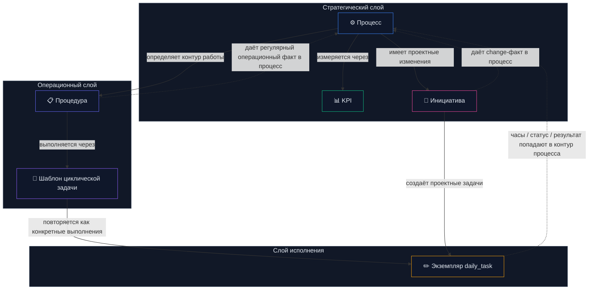
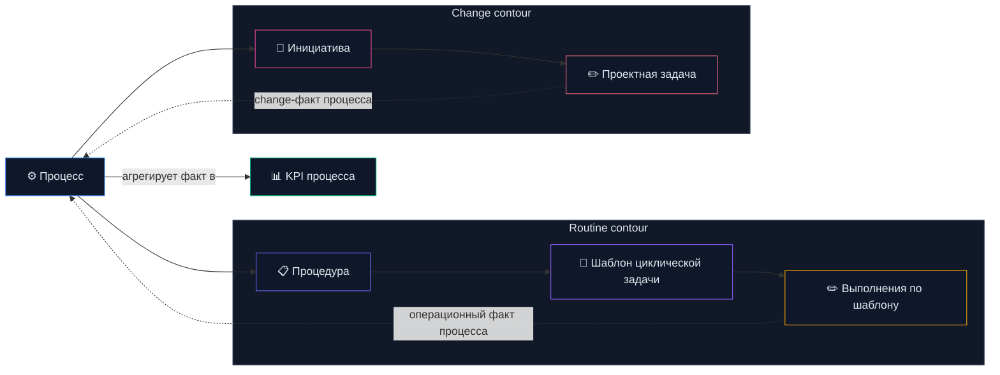
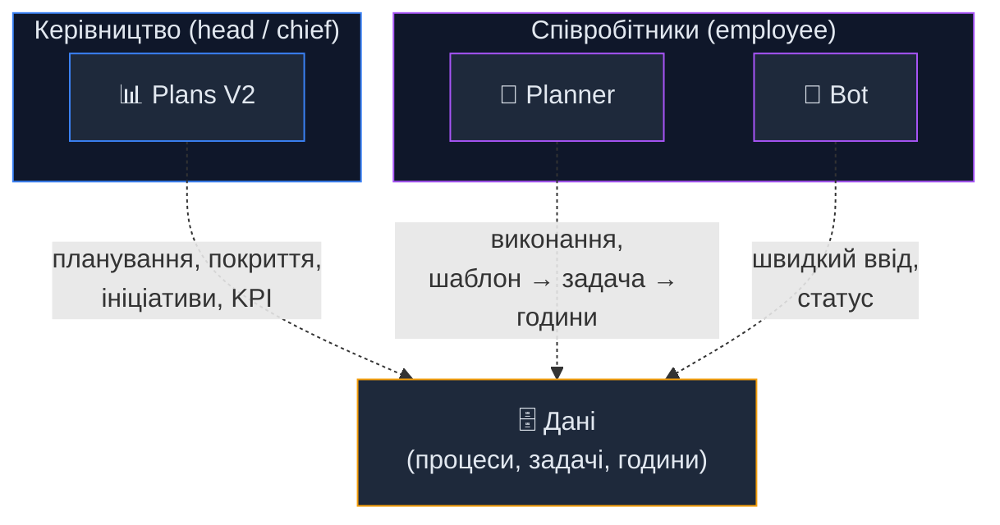
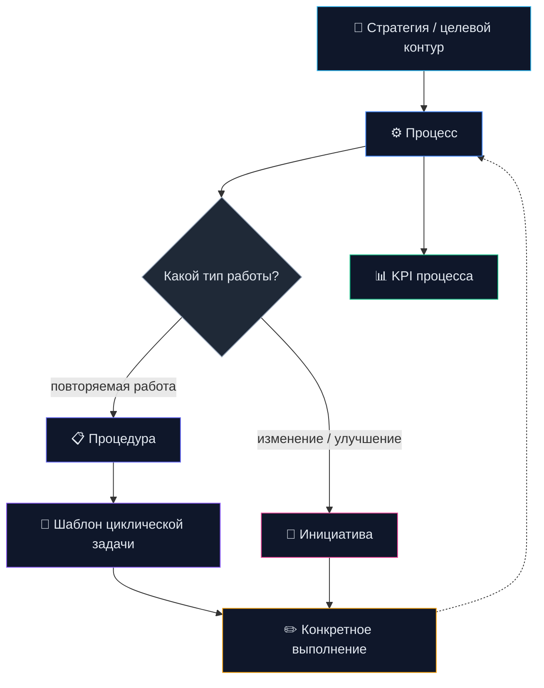
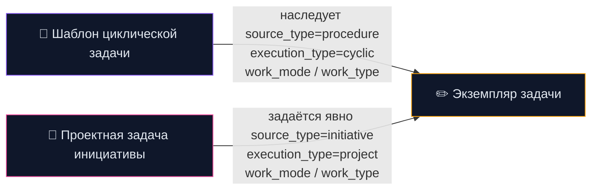
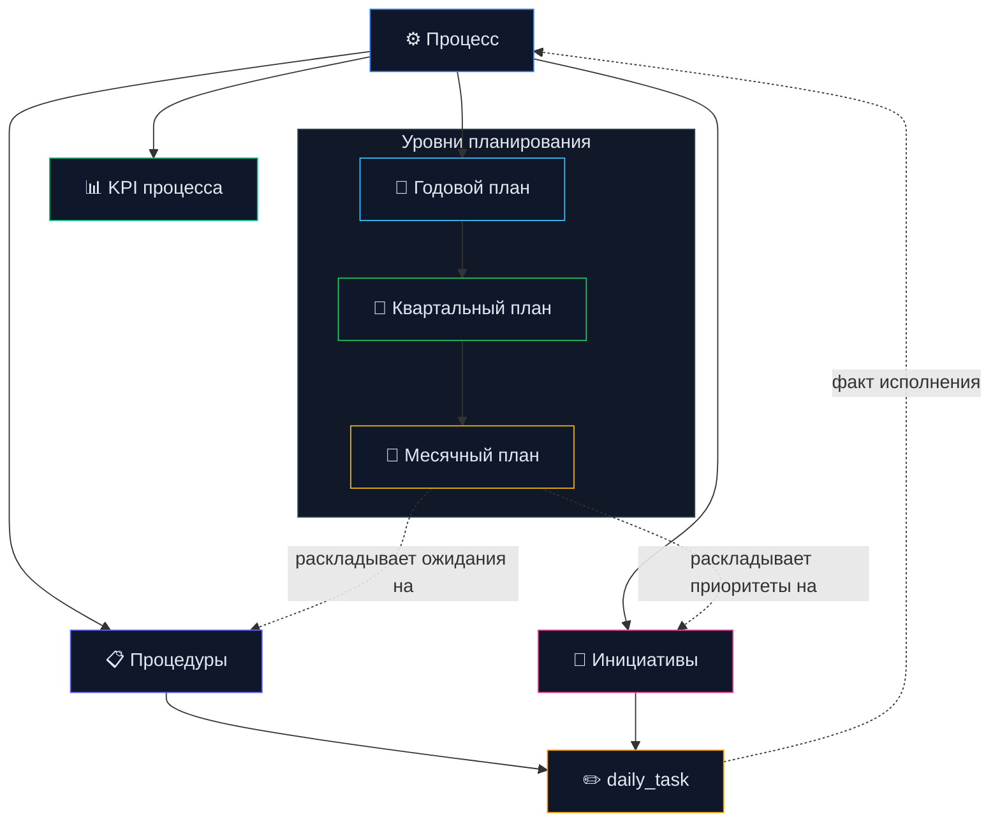

# Стратегия развития: Plans V2, Planner, KPI, процессная модель

> Последнее обновление: 2026-04-01
> Консолидация из: SOC_KPI_IDEAS, PLANSV2_PLANNER_TARGET_MODEL, POLICY_PROCESS_MATRIX, PROCESS_TARGET_MAP_AND_ROADMAP
> Данные БД: снапшот 2026-03-31

---

## 1. Архитектурная модель

### Модель в одном абзаце

Процесс — это верхний контейнер ответственности и уровень KPI. Внутри процесса
есть процедуры и инициативы. Процедура — это устойчивый operational block с
понятным набором сотрудников, регулярной нагрузкой и ограниченным набором
типовых шаблонов задач. Инициатива — это change-work внутри того же процесса,
обычно с квартальной оценкой трудоёмкости, но без жёсткого регулярного ритма.
Шаблон задаёт канонический вид повторяемой работы. `daily_task` фиксирует
конкретный факт выполнения. KPI агрегируют факт только на уровне процесса.

### Архитектурные правила модели

1. Процесс — единственный верхний уровень KPI.
2. Процедуры и инициативы не конкурируют, а являются двумя источниками работы внутри процесса.
3. Процедура — не просто папка шаблонов, а единица исполнения.
4. Шаблоны нужны для повторяемой работы внутри процедуры.
5. `daily_task` — единственная единица фактического исполнения.
6. Capacity процедуры считается из ресурса сотрудников, а не делится поровну "по участию".
7. Инициативы планируются через квартальную оценку change-load, а не через жёсткий регулярный норматив.
8. Распределение по компаниям живёт на уровне задач и не должно раздувать число процедур.
9. Планы задают ожидания и горизонт, но не являются источником работы.
10. KPI процесса и company allocation задачи — разные аналитические оси.

### Схема 1. Каркас сущностей и связей



Архитектурные принципы:
- Процесс — главный контейнер смысла и ответственности
- Процедура — operational unit внутри процесса: у неё есть свой кусок работы, свои исполнители и плановый объём времени
- Шаблон задачи — это не просто заготовка, а типовая циклическая единица работы процедуры
- `daily_task` — конкретный экземпляр выполнения шаблона или проектной задачи
- Инициатива — change path внутри того же процесса, обычно с квартальной оценкой нагрузки, но без жёсткого регулярного ритма
- KPI считаются только на уровне процесса и агрегируют весь факт внутри него

### Схема 2. Два контура работы: routine vs change



Смысл схемы:
- процедуры и шаблоны нужны для повторяемой работы;
- процедура задаёт не только группу шаблонов, но и рамки исполнения для группы сотрудников;
- шаблон = канонический тип циклической задачи внутри процедуры;
- инициативы нужны для изменений;
- у процедур время и исполнители определены через employee allocation, у инициатив время задаётся как quarterly change estimate;
- оба контура расходуют capacity одного и того же процесса;
- KPI агрегируют общий факт процесса и показывают баланс между routine и change.

### Схема 3. Інструменти (хто через що працює)



`Plans V2`, `Planner`, `Bot` — это инструменты и точки входа, а не часть доменной модели.
Политики СУІБ связаны с процессами через маппинг покрытия, но не входят в операционный pipeline выполнения.

### Схема 4. Как читать модель сверху вниз



---

## 2. Целевое разделение модулей

| Модуль | Роль | Аудитория |
|--------|------|-----------|
| **Plans V2** | Управленческий слой: покрытие, нагрузка, резерв, planned/unplanned, инициативы | Heads / Chiefs |
| **Planner** | Исполнительский слой: слот → шаблон → часы → компания | Employees |
| **Task Templates** | Канонические циклические задачи внутри процедур | Системный |
| **Initiatives** | Change-слой внутри процесса: цель, deliverable, статус, quarterly change estimate | Heads / Chiefs |
| **KPI** | Агрегатор факта на уровне процесса: plan + actual + capacity + unplanned | Автоматический |

Принцип исполнения: **минимум ручного ввода**, `template-first`, комментарий только для инцидентов и отклонений.

---

## 3. Текущее состояние процессной модели (снапшот 2026-03-31)

### Агрегированное покрытие

| Процесс | Процедур | Шаблонов | Задач | Часы |
|---|---:|---:|---:|---:|
| Моніторинг та реагування на події та інциденти ІБ | 2 | 10 | 794 | 2274.7 |
| Управління правами доступу | 2 | 5 | 178 | 1181.0 |
| Взаємодія з контрагентами | 3 | 13 | 161 | 839.0 |
| Управління ризиками ІБ | 4 | 4 | 110 | 591.0 |
| Управління документацією СУІБ | 4 | 4 | 163 | 538.0 |
| Управління захистом даних в ІС | 4 | 16 | 73 | 432.0 |
| Управління безпекою ІС | 5 | 8 | 169 | 832.0 |
| Управління безпекою обчислювальних систем | 2 | 3 | 70 | 378.5 |
| Навчання та підвищення обізнаності | 2 | 7 | 49 | 246.0 |
| Облік та звітність | 3 | 10 | 47 | 173.5 |
| **Управління безпекою мережі** | **2** | **0** | **0** | **0.0** |

Использование шаблонов: **~136 из шаблона vs ~1464 manual** — шаблонная модель пока не основной контур.

### Целевая process map по уровням

| Уровень | Процессы |
|---------|----------|
| **A. Core operations** | Моніторинг/реагування, Управління доступом, Управління ризиками |
| **B. Engineering & control** | Безпека ІС, Безпека мережі, Безпека обчислювальних систем, Захист даних |
| **C. Governance** | Документація СУІБ, Навчання, Взаємодія з контрагентами, Облік/звітність |
| **D. Candidates** | Криптозахист, Безперервність, Мобільні пристрої, Захист від malware, Фізична безпека |

---

## 4. Главные разрывы

1. **KB и процессы не связаны** — документы есть, процессы есть, но `kb_documents.process_id` не используется как рабочая привязка
2. **Не все политики СУІБ покрыты процессами** — crypto, malware, mobile, physical security, continuity не имеют соответствующих процессов в маппинге покрытия
3. **Пустые процессы** — "Управління безпекою мережі": 0 шаблонов, 0 задач
4. **Шаблоны не стали основным путём** — ~8% задач из шаблонов
5. **Пустые title в задачах** — мешает аналитике и будущему KPI

---

## 5. Семантические шаблоны задач (целевая модель)

### Типизация задач как отдельное измерение модели

Тип задачи в этой архитектуре не равен просто названию задачи. Это отдельный слой
смысла, который нужен для правильной маршрутизации работы, аналитики и KPI.

Одна и та же задача должна отвечать минимум на четыре вопроса:
- из какого контура она пришла: процедура или инициатива;
- это циклическая работа или проектная;
- работа плановая или реактивная;
- какой у неё операционный смысл для аналитики процесса.

### Базовые оси типизации

| Ось | Поле | Значения | Зачем нужно |
|---|---|---|---|
| Источник работы | `source_type` | `procedure`, `initiative` | Понять, это routine contour или change contour |
| Характер исполнения | `execution_type` | `cyclic`, `project` | Отличить повторяемое выполнение от разовой проектной работы |
| Режим работы | `work_mode` | `planned`, `unplanned` | Делить baseline и reactive load |
| Операционный смысл | `work_type` | `monitoring`, `event_analysis`, `incident_response`, `request_processing`, `reporting`, `audit`, `tuning`, `improvement`, `internal_admin` | Нормальный срез KPI и нагрузки |

### Логика наследования



### Архитектурный смысл

- Шаблон задаёт типовую циклическую работу процедуры
- Конкретная задача наследует типизацию от шаблона, если она создана из процедуры
- Проектная задача инициативы может создаваться без шаблона, но всё равно обязана иметь типизацию
- KPI не считаются на уровне типа задачи напрямую, но используют типизацию как разрез аналитики внутри процесса

### Процедура как единица исполнения

В этой модели процедура нужна не только для группировки шаблонов.

Процедура одновременно задаёт:
- понятный кусок большого процесса;
- ограниченный набор типовых шаблонов;
- круг сотрудников, которые работают в этом контуре;
- ожидаемый объём регулярного времени.

Практически это означает:
- большой процесс можно разложить на 3–5 процедур;
- в каждой процедуре держать 3–5 шаблонов;
- сотрудники работают не с "всем процессом сразу", а в рамках своей процедуры;
- факт по задачам затем агрегируется обратно на уровень процесса.

### Ресурс сотрудников и capacity процедуры

Если сотрудник участвует в нескольких процедурах, его время нельзя делить
поровну автоматически. Участие в процедуре и доля ресурса в процедуре — это
разные сущности.

Поэтому архитектурно нужно разделять:
- `assignment` — сотрудник участвует в процедуре;
- `allocation` — какая доля ресурса сотрудника уходит в процедуру.

Следствие:
- capacity процедуры не задаётся "вручную из воздуха";
- capacity процедуры вычисляется из аллокаций сотрудников;
- один сотрудник может участвовать в нескольких процедурах одного или разных процессов;
- доли участия могут быть разными и не обязаны делиться пропорционально.

Принцип расчёта:

```text
employee quarterly capacity × allocation share
    → contribution to procedure capacity

sum(contributions of all employees)
    → procedure capacity

sum(capacity of procedures in process)
    → process capacity
```

Это нужно для KPI, потому что KPI процесса должны опираться на реальный ресурс
людей, а не на условное "ожидаемое время процедуры".

Практическая трактовка:
- участие сотрудника в процедуре ещё не означает равную долю времени;
- доля времени должна задаваться явно;
- одна и та же процедура может собирать capacity из нескольких людей;
- один и тот же сотрудник может давать разный вклад в разные процедуры и процессы.

### Отдельное измерение: распределение задач по компаниям

Для помесячного учёта по предприятиям задача может делиться по компаниям с
весами. Это распределение не должно зашиваться в процедуры, иначе модель
процедур начнёт разрастаться только ради аналитики компаний.

Архитектурно это отдельное измерение, независимое от KPI процесса:
- процесс отвечает за KPI;
- процедура отвечает за operational unit и шаблоны;
- задача отвечает за факт выполнения;
- распределение по компаниям отвечает только за управленческий и отчётный учёт по предприятиям.

Правильная логика:
- одна и та же процедура может обслуживать несколько компаний;
- одна и та же задача может относиться к нескольким компаниям;
- связь с компаниями должна жить на уровне задачи, а не на уровне процедуры;
- распределение должно быть весовым, а не бинарным.

Пример:

```text
daily_task
  ├── company A = 60%
  └── company B = 40%
```

Что это даёт:
- не нужно плодить процедуры под каждую компанию;
- можно корректно строить месячный учёт по предприятиям;
- одна задача остаётся одной задачей в процессе;
- company split не ломает KPI процесса, а существует как параллельный аналитический слой.

Архитектурный принцип:
- `process KPI` и `company allocation` — разные оси модели;
- KPI агрегируются по процессу;
- company allocation агрегируется по задачам;
- пересекать их можно в аналитике, но не смешивать в самой структуре сущностей.

### Практический вывод

Минимальный набор для будущей модели:
- у шаблона есть `work_mode`, `work_type`, `default_expected_hours`, `default_effort_weight`
- у конкретной задачи есть `source_type`, `execution_type`, `work_mode`, `work_type`, `expected_hours`, `effort_weight`
- у инициативных задач `source_type=initiative`, `execution_type=project`
- у процедурных циклических задач `source_type=procedure`, `execution_type=cyclic`

### Новые поля для `procedure_task_templates`

| Поле | Значения | Назначение |
|------|----------|------------|
| `work_mode` | `planned` / `unplanned` | Плановая vs реактивная работа |
| `work_type` | `monitoring`, `event_analysis`, `incident_response`, `request_processing`, `reporting`, `audit`, `tuning`, `improvement`, `internal_admin` | Операционный смысл |
| `default_expected_hours` | число | Ожидаемая трудоёмкость |
| `default_effort_weight` | число | Вес для взвешенной аналитики |
| `requires_comment` | bool | Комментарий обязателен (инциденты, отклонения) |

### Новые поля для `daily_tasks` (наследуются от шаблона)

- `work_mode`, `work_type`, `effort_weight`, `expected_hours`
- `is_exception`, `deviation_reason`

### Пример

Процедура: Моніторинг подій ІБ

| Шаблон | work_mode | work_type |
|--------|-----------|-----------|
| Моніторинг подій | planned | monitoring |
| Аналіз підозрілої події | unplanned | event_analysis |
| Реагування на інцидент | unplanned | incident_response |

---

## 5b. Инициативы (проектная работа внутри процесса)

Инициатива — разовая проектная/улучшенческая работа, привязанная к процессу, но НЕ являющаяся процедурой.

**Примеры:** внедрение нового SIEM, разработка политики криптозащиты, миграция системы контроля доступа.

### Каскадирование по уровням планов

Инициативы следуют той же иерархии что и планы:

```text
Годовий план процесу
  └── Ініціатива: "Впровадження SIEM" (рік, ціль + бюджет)
        └── Квартальний план
              └── Ініціатива: "Етап 1 — вибір рішення" (Q1, deliverable)
                    └── Місячний план
                          └── Задачі: конкретна робота (daily_tasks)
```

- **Годовая** — стратегическая цель, бюджет, ожидаемый результат
- **Квартальная** — этап с конкретным deliverable и оценочным change-load
- **Месячная** — разбивка на задачи сотрудникам

Инициатива может существовать на любом уровне — не обязательно каскадировать сверху вниз. Квартальная инициатива может быть без годовой.

### Текущее состояние БД
- `quarterly_plan_initiatives` (id, quarterly_plan_id, title, description, status) — уже существует
- `daily_tasks.project_id` — привязка задач к проекту уже есть
- **Нет:** годовых и месячных инициатив (нужны `annual_plan_initiatives`, `monthly_plan_initiatives` или единая таблица с уровнем)

### Отличие от процедур

| | Процедура | Инициатива |
|---|---|---|
| Характер | Рутинная, повторяющаяся | Разовая, проектная |
| Роль в процессе | Operational unit | Change unit |
| Исполнители | Обычно заранее понятны и закреплены | Могут меняться по этапам |
| Время | Есть capacity из employee allocations | Есть квартальная оценка change-load, но нет жёсткого регулярного ритма |
| Уровни | Постоянная, привязана к процессу | Годовая → квартальная → месячная |
| Шаблоны | Да (template-first) | Нет (свободные задачи) |
| KPI | Даёт регулярный операционный факт в процесс | Даёт change-факт в процесс |
| Горизонт | Постоянный | Год / квартал / месяц / дедлайн |
| Ввод сотрудника | Шаблон → часы | Задача → часы → результат |

### Связь с KPI
- KPI — процессный. Инициатива привязана к процессу → её факт идёт в тот же котёл процесса
- Capacity процесса в основном идёт снизу от процедур через employee allocations
- Для инициатив нужен отдельный quarterly estimate, чтобы change-load не был "невидимым" в плане
- **Ничего не меняется в верхнем уровне KPI** — инициатива остаётся ещё одним источником факта внутри процесса
- Полезная аналитика сверху: баланс routine/change по процессу и доля change-load в квартале

---

## 6. Где в модели находятся планы

План в этой архитектуре не является источником работы сам по себе. План — это слой
управления и распределения ожиданий поверх процесса.

Иначе:
- процесс = что мы вообще делаем;
- процедура / инициатива = откуда берётся работа;
- задача = что реально выполняется;
- план = сколько, когда и в каком горизонте мы ожидаем выполнить.

### Схема 5. Планы как управленческий слой над процессом



### Основной принцип

- План не подменяет процесс
- План не подменяет инициативу
- План не подменяет задачу
- План задаёт горизонт, объём, приоритет и ожидание
- KPI сравнивают план процесса с фактом процесса
- Для процедур плановое время задаётся через employee allocations
- Для инициатив плановое время задаётся как quarterly change estimate

### Как это читать

| Сущность | Роль |
|---|---|
| `annual plan` | Годовой целевой контур процесса: capacity, направления, резерв |
| `quarterly plan` | Плановый operational/change baseline на квартал |
| `monthly plan` | Ближайшая управленческая раскладка нагрузки |
| `procedure` | Повторяемый источник работы |
| `initiative` | Источник проектной работы |
| `daily_task` | Фактическое исполнение |
| `KPI` | Сравнение plan vs actual на уровне процесса |

### Что важно не смешивать

- План — это не работа, а ожидание работы
- Инициатива — это не план, а источник change-работы
- Процедура — это не план, а источник регулярной работы
- Задача — это не план, а факт исполнения

### Практический вывод

Плановая модель должна отвечать на три разных вопроса:
- что должно происходить регулярно в процессе;
- какие изменения должны происходить в процессе;
- сколько capacity и какого факта ожидается в этом горизонте.

---

## 7. Целевые метрики KPI

> **Обновление 2026-04-07:** KPI-модель уточнена и вынесена в отдельный документ
> **[`docs/KPI_MODEL.md`](./KPI_MODEL.md)** (4 метрики + матрица диагностики «ресурсы vs квалификация», разделение routine / initiative_planned / initiative_unplanned, никакой премиальной формулы внутри системы).
> Раздел ниже сохранён как историческая запись первой версии модели.

Не только `fact / plan`, а:

| Метрика | Формула |
|---------|---------|
| Capacity Coverage | Capacity / Required Load |
| Plan Coverage | Actual Planned Work / Planned Baseline |
| Reserve Consumption | Unplanned Work / Reserve |
| Utilization | Actual Total Work / Capacity |
| Overload Gap | Required Load − Capacity |

Разрезы: по процессу, процедуре, компании, сотруднику.

Дополнительно: planned/unplanned split, incident share, company-driven reactive load, template mix.

---

## 8. Roadmap

### Phase 1. Нормализация process map
- Закрепить canonical list процессов от политик СУІБ
- Связать `kb_documents → processes`
- Определить ownership по каждому процессу

### Phase 2. Очистка существующих процессов
Приоритет: Моніторинг → Безпека ІС → Доступ → Ризики
- Пересмотреть описания процедур
- Развести governance vs execution
- Выделить недостающие operational procedures

### Phase 3. Заполнить пустые operational gaps
- Управління безпекою мережі (0 шаблонов, 0 задач)
- Backup/recovery, continuity
- Policy areas без явного процесса (crypto, malware, mobile, physical)

### Phase 4. Семантические шаблоны
- Расширить `procedure_task_templates` новыми полями
- Расширить `daily_tasks` наследуемыми полями
- Классифицировать существующие шаблоны
- Перевести planner flow на template-first

### Phase 5. Очистка фактических задач
- Разобраться с пустыми `daily_tasks.title`
- Ввести обязательные значения от шаблона
- Минимизировать ручной free-text ввод

### Phase 6. Новый KPI
- Capacity / baseline / reserve модель на квартальном уровне
- Planned/unplanned split на месячном/процедурном уровне
- Process/company/employee overload analytics

---

## 9. Маппинг покрытия: процессы ↔ политики (сводка)

> Процессы и политики — независимые сущности. Маппинг показывает, какие процессы
> обеспечивают соблюдение каких политик. Это аналитика покрытия, а не иерархия.

### Полное покрытие
- Моніторинг та реагування ↔ Вимоги щодо моніторингу
- Управління доступом ↔ Вимоги щодо управління правами доступу
- Управління ризиками ↔ Методологія управління ризиками + Вимоги щодо ідентифікації ризиків
- Документація СУІБ ↔ Вимоги щодо управління документацією
- Навчання ↔ Вимоги щодо навчання та обізнаності
- Безпека ІС ↔ Вимоги щодо налаштування безпеки ІС + вразливості ІС
- Безпека обчислювальних систем ↔ Вимоги щодо налаштування + вразливості

### Частичное покрытие
- Безпека мережі ↔ Вимоги є, але процес порожній
- Резервне копіювання ↔ процедура є, факту немає
- Життєвий цикл ІС ↔ перетинає кілька процесів
- Безперервність ↔ вбудовано в risk management

### Разрывы (политика есть, процесса нет)
- Криптографічний захист інформації
- Захист від зловмисного коду
- Безпека мобільних пристроїв
- Фізична безпека серверних приміщень

---

## 10. Open Questions / Decisions To Lock

Ниже список решений, которые лучше зафиксировать отдельно до перехода к финальной
модели таблиц, API и UI.

### 1. Где хранить employee allocation на процедуры

Нужно определить:
- отдельная таблица allocations;
- связь allocation с кварталом;
- хранится ли allocation в процентах, весах или часах;
- допускается ли смешанная модель (проценты + override в часах).

Рекомендуемое направление:
- хранить allocation как квартальную долю ресурса сотрудника на процедуру;
- capacity процедуры считать производно.

### 2. Как фиксировать quarterly change estimate для инициатив

Нужно определить:
- estimate хранится на инициативе или на quarterly-plan-initiative;
- estimate задаётся в часах, story points или effort weight;
- можно ли дробить estimate по месяцам.

Рекомендуемое направление:
- quarterly change estimate хранить на квартальной инициативе в часах;
- monthly split считать вторичным и необязательным.

### 3. Нужно ли хранить связь `daily_task -> template_id`

Сейчас модель проекта ближе к подходу, где шаблон только подставляет данные, а
задача становится самостоятельной.

Нужно окончательно решить:
- оставляем задачу без FK на шаблон;
- или добавляем слабую связь для аналитики происхождения.

Рекомендуемое направление:
- не делать жёсткий FK обязательным;
- при необходимости хранить nullable reference только для traceability.

### 4. Где хранить company allocation задачи

Нужно определить:
- отдельная таблица many-to-many с весом на компанию;
- хранится ли вес в процентах или в нормализованной доле;
- допустимы ли задачи без company split.

Рекомендуемое направление:
- task-company allocation хранить в отдельной таблице;
- вес считать независимым от KPI-потока процесса.

### 5. На каком уровне показывать KPI в UI

Сейчас архитектурно KPI процессные.

Нужно определить:
- показываем ли KPI только по процессам;
- разрешаем ли drill-down по процедурам как аналитический view;
- как показывать routine/change split.

Рекомендуемое направление:
- KPI считать только по процессам;
- процедуры использовать как drill-down и explain layer.

### 6. Нужно ли закреплять сотрудников за процедурами жёстко

Нужно определить:
- assignment обязателен всегда;
- можно ли создавать задачу в процедуре без формального assignment;
- как обрабатывать временное подключение сотрудника к процедуре.

Рекомендуемое направление:
- assignment обязателен для плановой модели;
- временные отклонения разрешать как exception path.

### 7. Какой минимальный обязательный набор полей у задачи

Нужно определить минимальный контракт `daily_task`, чтобы дальше не плодить
неполные сущности.

Рекомендуемое направление:
- `source_type`
- `execution_type`
- `work_mode`
- `work_type`
- `spent_hours`
- `task_date`
- `process_id` или выводимый process context
- optional `company allocation`

### 8. Как формально развести procedure capacity и initiative load

Нужно определить:
- входят ли инициативы в общий capacity ceiling процесса;
- показывается ли initiative load как reserve consumption;
- считаются ли инициативы отдельно от baseline procedure capacity.

Рекомендуемое направление:
- procedure capacity считать как baseline resource model;
- initiative load считать как separate quarterly change load;
- сводить их вместе только на уровне process KPI.
