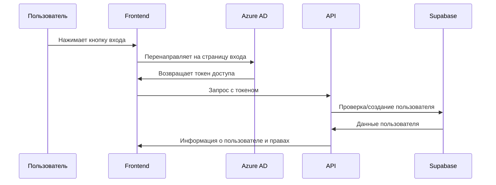
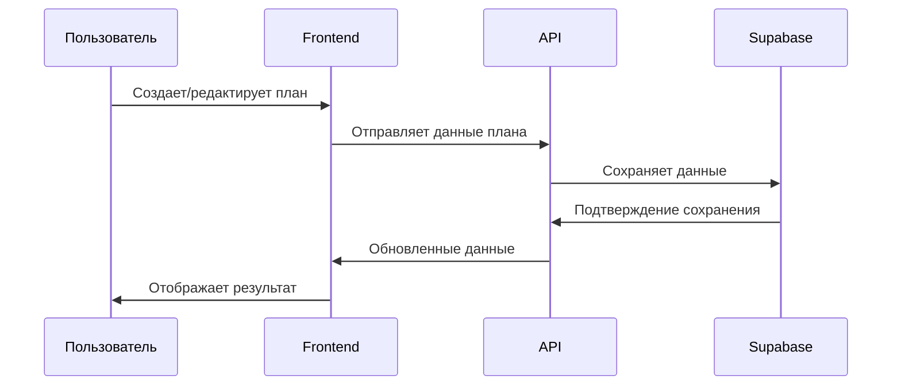
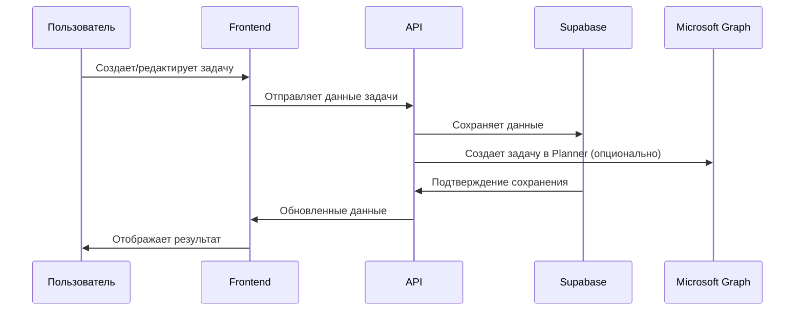

# Архитектура проекта ReportIB

## Общее описание

ReportIB — это система управления планами, задачами и отчетами, разработанная для оптимизации рабочих процессов в организации. Платформа позволяет создавать и отслеживать годовые, квартальные и недельные планы, управлять задачами, формировать отчеты, а также вести учет сотрудников, отделов и компаний-партнеров.

## Технологический стек

Проект построен на основе современного технологического стека:

- **Frontend**: Next.js, React, Tailwind CSS
- **Backend**: Next.js API Routes, Supabase
- **Аутентификация**: Microsoft 365 (Azure AD), MSAL
- **База данных**: PostgreSQL (через Supabase)
- **Хранилище файлов**: Supabase Storage
- **Развертывание**: Vercel

## Архитектурные принципы

1. **Компонентный подход**
   - Модульная архитектура с четким разделением ответственности
   - Переиспользуемые компоненты для обеспечения единообразия интерфейса
   - Изолированные модули с четко определенными интерфейсами

2. **Клиент-серверная архитектура**
   - Frontend на Next.js для рендеринга пользовательского интерфейса
   - Backend на Next.js API Routes для обработки запросов
   - Supabase для хранения данных и управления аутентификацией

3. **Контекстно-ориентированное проектирование**
   - Разделение функциональности по бизнес-доменам
   - Каждый модуль отвечает за конкретную бизнес-функцию
   - Четкие границы между модулями

## Структура проекта

```
src/
├── app/                          # Next.js App Router
│   ├── api/                      # API-маршруты
│   ├── dashboard/                # Страницы дашборда
│   │   ├── plans/                # Страницы планов
│   │   ├── tasks/                # Страницы задач
│   │   └── reports/              # Страницы отчетов
│   ├── employees/                # Страницы сотрудников
│   └── login/                    # Страница входа
├── components/                   # React-компоненты
│   ├── auth/                     # Компоненты аутентификации
│   ├── dashboard/                # Компоненты дашборда
│   │   ├── content/              # Основной контент разделов
│   │   ├── Tasks/                # Компоненты для работы с задачами
│   │   └── reports/              # Компоненты для работы с отчетами
│   ├── employees/                # Компоненты для работы с сотрудниками
│   └── planning/                 # Компоненты для работы с планами
├── context/                      # React-контексты
├── hooks/                        # Пользовательские хуки
├── lib/                          # Вспомогательные функции и сервисы
│   ├── auth/                     # Аутентификация (Azure AD + Supabase)
│   ├── plans/                    # Сервисы для работы с планами
│   ├── tasks/                    # Сервисы для работы с задачами
│   └── supabase.ts               # Клиент Supabase
├── services/                     # Сервисы для внешних API
│   └── graph/                    # Сервисы для Microsoft Graph API
├── styles/                       # Глобальные стили
└── types/                        # TypeScript типы и интерфейсы
```

## База данных

Подробная документация схемы БД: [docs/database/SCHEMA.md](../database/SCHEMA.md)

### Ключевые таблицы
- `user_profiles` - Профили пользователей
- `departments` - Отделы
- `annual_plans`, `quarterly_plans`, `weekly_plans` - Иерархия планов
- `weekly_tasks` - Задачи
- `companies` - Компании-партнеры
- `kpi_metrics`, `kpi_values` - KPI метрики

### Представления (Views)
- `v_user_details` - Детали пользователя с отделом
- `v_annual_plans`, `v_quarterly_plans`, `v_weekly_plans` - Планы с агрегацией
- `v_active_weekly_plans` - Активные недельные планы
- `v_kpi_current` - Текущие значения KPI

### RPC Functions
- `manage_annual_plan`, `manage_quarterly_plan`, `manage_weekly_plan` - CRUD планов
- `manage_weekly_task` - Управление задачами
- `upsert_user_profile` - Создание/обновление профиля

## Модули системы

ReportIB состоит из следующих основных модулей:

1. **Авторизация**
   - Аутентификация через Microsoft 365 (Azure AD)
   - Управление ролями и правами доступа
   - Защита маршрутов и контроль доступа к функциям

2. **Планы**
   - Управление годовыми, квартальными и недельными планами
   - Отслеживание статусов и прогресса выполнения планов
   - Иерархическая структура планов (годовой → квартальный → недельный)

3. **Задачи**
   - Канбан-доска для управления задачами
   - Привязка задач к недельным планам
   - Отслеживание статусов и сроков выполнения

4. **Отчеты**
   - Формирование отчетов по планам и задачам
   - Визуализация данных и статистики
   - Экспорт отчетов в различные форматы

5. **Сотрудники**
   - Управление данными сотрудников
   - Организационная структура и иерархия
   - Интеграция с Azure AD

6. **Компании**
   - Управление данными о компаниях-партнерах
   - Связь компаний с проектами и планами
   - Контактная информация и договоры

7. **Активность**
   - Отслеживание активности пользователей
   - Уведомления о важных событиях
   - Дашборд с ключевыми показателями

## Потоки данных

### 1. Аутентификация пользователя



### 2. Работа с планами



### 3. Работа с задачами



## Безопасность

1. **Аутентификация**
   - Использование OAuth 2.0 и OpenID Connect через Azure AD
   - Хранение токенов в защищенном хранилище
   - Автоматическое обновление токенов

2. **Авторизация**
   - Ролевая модель доступа (RBAC)
   - Проверка прав доступа на уровне API и UI
   - Защита маршрутов от несанкционированного доступа

3. **Защита данных**
   - Шифрование данных в Supabase
   - HTTPS для всех коммуникаций
   - Валидация входных данных на клиенте и сервере

## Масштабируемость

1. **Горизонтальное масштабирование**
   - Бессерверная архитектура на Vercel
   - Автоматическое масштабирование в зависимости от нагрузки

2. **Оптимизация производительности**
   - Серверные компоненты Next.js для оптимизации рендеринга
   - Кэширование данных на клиенте и сервере
   - Оптимизация запросов к базе данных

3. **Модульность**
   - Возможность добавления новых модулей без изменения существующих
   - Четкие интерфейсы между модулями

## Интеграции

1. **Microsoft 365**
   - Аутентификация через Azure AD
   - Синхронизация данных пользователей
   - Интеграция с Microsoft Planner и Calendar

2. **Supabase**
   - Хранение данных в PostgreSQL
   - Realtime подписки для обновления данных в реальном времени
   - Хранение файлов в Supabase Storage

3. **Внешние API**
   - Возможность интеграции с другими системами через API
   - Экспорт данных в различные форматы

## Рекомендации по развитию

1. **Улучшение UX/UI**
   - Разработка мобильной версии приложения
   - Внедрение дополнительных визуализаций данных
   - Улучшение доступности для пользователей с ограниченными возможностями

2. **Расширение функциональности**
   - Добавление модуля аналитики и бизнес-интеллекта
   - Внедрение системы уведомлений и напоминаний
   - Разработка мобильного приложения

3. **Оптимизация производительности**
   - Внедрение кэширования на уровне API
   - Оптимизация запросов к базе данных
   - Внедрение виртуализации для больших списков данных

4. **Улучшение безопасности**
   - Внедрение двухфакторной аутентификации
   - Аудит безопасности и пентестинг
   - Расширение логирования действий пользователей
